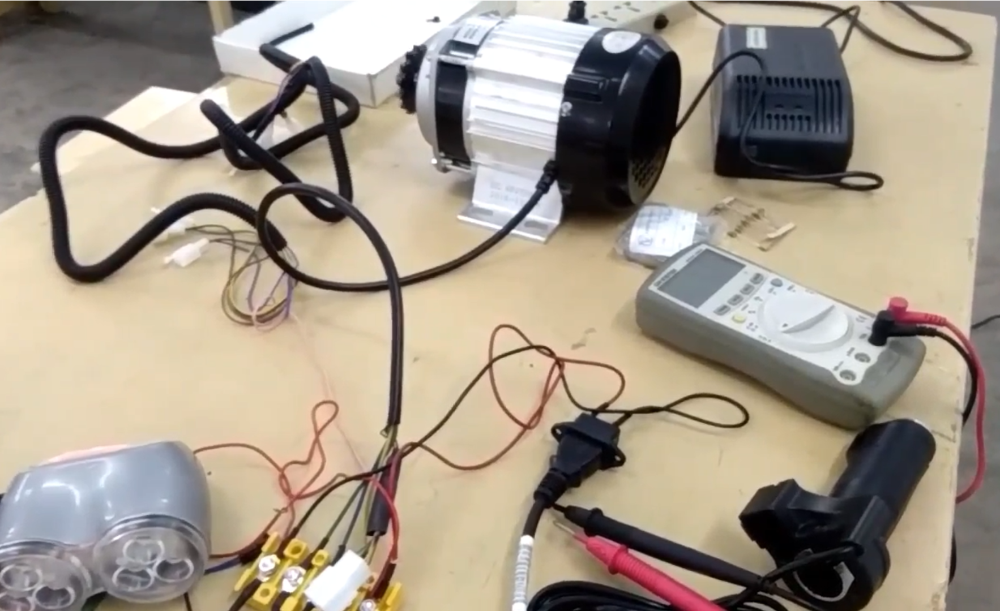

# 48volt-BLDC-Motor-Controll
Control a 48 volt 750wt BLDC motor using Arduino_MCU totally computerized Clockwise,Counter Clockwise rotation and Braking with respect to Ultrasonnic sensor...

## Connection of this BLDC Motor is below:

